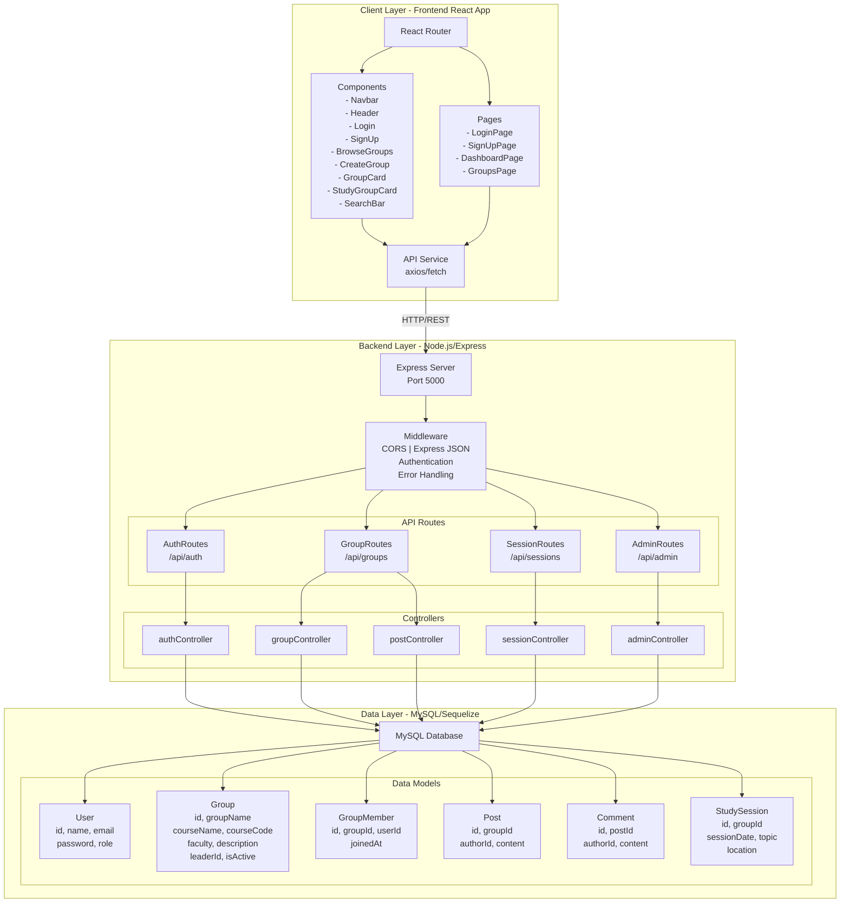
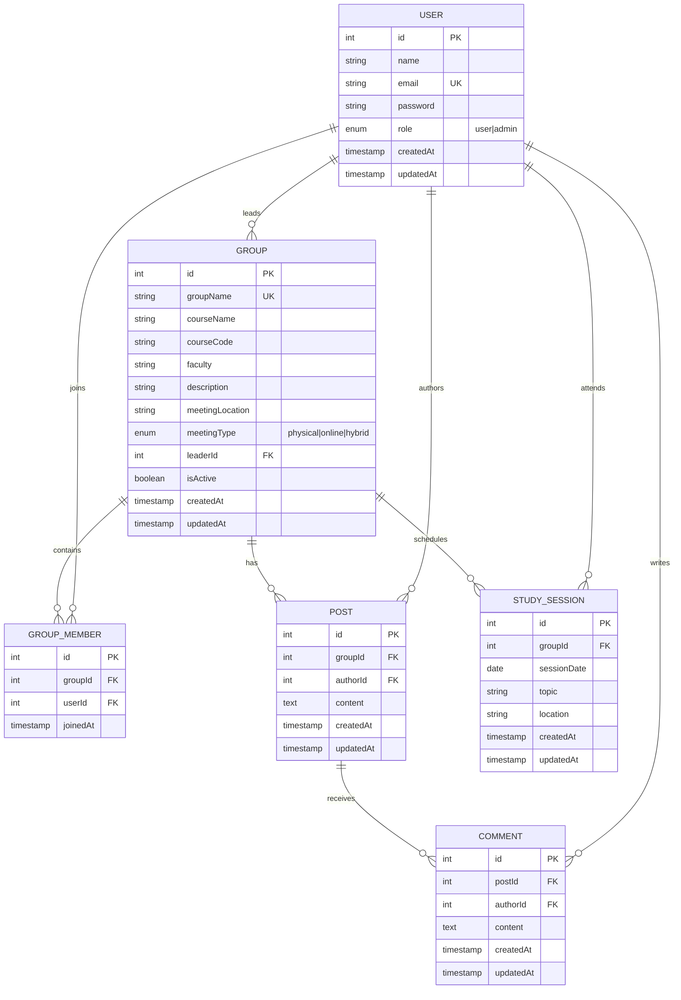

# System Architecture and Entity Relationship Diagrams

## 1. System Architecture Diagram

This diagram shows the overall structure of the WebCourseWork application, including frontend, backend, database, and their interactions.

---

## 2. Entity Relationship Diagram (ERD)

This diagram illustrates the relationships between database entities and their attributes.

---

## 3. Data Flow Diagram

This diagram shows how data flows through the application from user interactions to database storage and retrieval.

```mermaid
graph LR
    User["👤 User/Client"]
    Browser["🌐 Browser<br/>React Application"]
    Frontend["Components &<br/>State Management"]
    APICall["HTTP<br/>Requests"]
    Server["🖥️ Express Server"]
    Routes["Route Handlers"]
    Controllers["Business Logic<br/>Controllers"]
    Models["Sequelize<br/>ORM Models"]
    DB["💾 MySQL<br/>Database"]

    User -->|Interacts| Browser
    Browser -->|Renders| Frontend
    Frontend -->|Makes| APICall
    APICall -->|Routes to| Server
    Server -->|Matches| Routes
    Routes -->|Calls| Controllers
    Controllers -->|Uses| Models
    Models -->|Query/Persist| DB
    DB -->|Returns/Saves| Models
    Models -->|Transforms| Controllers
    Controllers -->|Returns JSON| APICall
    APICall -->|Updates| Frontend
    Frontend -->|Re-renders| Browser
    Browser -->|Displays| User
```

---

## 4. API Endpoint Structure

### Authentication Routes (`/api/auth`)
- `POST /register` - Create new user account
- `POST /login` - Authenticate user
- `POST /logout` - End user session

### Group Routes (`/api/groups`)
- `GET /` - Get all groups
- `GET /:id` - Get specific group details
- `POST /` - Create new group
- `PUT /:id` - Update group
- `DELETE /:id` - Delete group
- `GET /:id/members` - Get group members
- `POST /:id/join` - Join a group
- `POST /:id/leave` - Leave a group

### Post Routes (`/api/groups/:groupId/posts`)
- `GET /` - Get all posts in a group
- `POST /` - Create new post
- `PUT /:id` - Update post
- `DELETE /:id` - Delete post

### Comment Routes (`/api/posts/:postId/comments`)
- `GET /` - Get all comments on a post
- `POST /` - Add new comment
- `DELETE /:id` - Delete comment

### Session Routes (`/api/sessions`)
- `GET /` - Get all study sessions
- `GET /:id` - Get specific session
- `POST /` - Create new session
- `PUT /:id` - Update session
- `DELETE /:id` - Delete session

### Admin Routes (`/api/admin`)
- `GET /users` - List all users
- `GET /groups` - List all groups
- `DELETE /users/:id` - Remove user
- `DELETE /groups/:id` - Remove group

---

## 5. Key Features & Components

### Frontend Features
- **Authentication**: Login and Sign Up pages
- **Discovery**: Browse and search study groups
- **Group Management**: Create, join, and view groups
- **Collaboration**: Post content and comment within groups
- **Session Scheduling**: Schedule and manage study sessions
- **Responsive Design**: Tailwind CSS for mobile-friendly UI

### Backend Features
- **User Management**: Registration, authentication, profiles
- **Group Management**: CRUD operations for study groups
- **Post & Comment System**: Discussion boards within groups
- **Session Management**: Schedule and track study sessions
- **Admin Panel**: User and group administration
- **Database ORM**: Sequelize for MySQL database management
- **Error Handling**: Centralized error handling middleware
- **CORS**: Cross-origin resource sharing enabled

